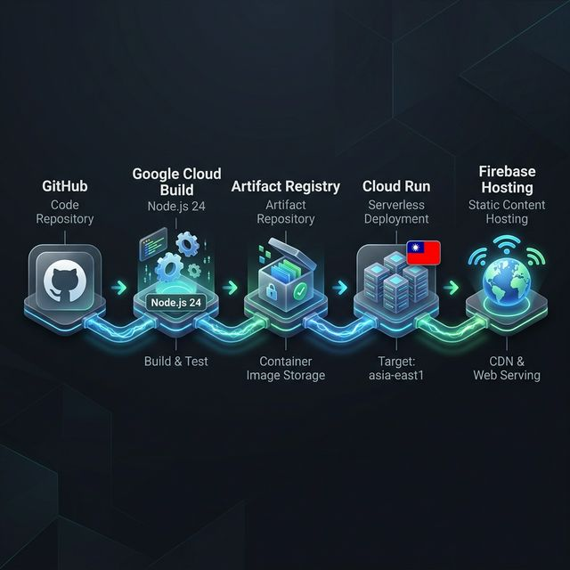

# 臺灣教育 Atlas — 學生人數分析工作台


> **地圖為核心、資料為脈絡的教育研究儀表板。** 以 PWA 形式發布，支援桌機與手機全離線瀏覽，深度分析台灣各級學校學生人數變遷。

[](https://web.dev/progressive-web-apps/)
[](https://react.dev/)
[](https://www.typescriptlang.org/)
[](https://vitejs.dev/)
[](https://cloud.google.com/run)
[](https://firebase.google.com/)

---

## 快速索引
- [✨ 核心功能](#-核心功能)
- [🛠️ 技術堆疊](#%EF%B8%8F-技術堆疊)
- [📂 專案結構](#-專案結構)
- [🚀 快速開始](#-快速開始)
- [📐 架構決策](#-架構決策)
- [🚢 部署資訊](#-部署資訊)
- [📓 規格文件](#-規格文件)

---

## ✨ 核心功能

- **深度地理視覺化**：結合 Leaflet 與 VectorGrid，即時呈現縣市、區域至各級學校的地理分布。
- **全方位數據圖表**：自研 SVG 圖表組件 (Trend, Scatter, Histogram, Stacked Area)，精準控數據視覺呈現。
- **PWA 全離線支援**：透過 Service Worker 實現秒級載入與全站離線瀏覽體驗。
- **校級導航系統**：從全國概覽、區域消長到單校追蹤，提供多層次的資料下鑽 (Drill-down) 體驗。
- **數據管線自動化**：整合官方教育數據刷新管線，確保資料時效性。

## 🛠️ 技術堆疊

| 領域 | 使用技術 |
|------|----------|
| **前端框架** | React 19, TypeScript 5.9 |
| **建置工具** | Vite 7.1 (極速開發/編譯) |
| **地理引擎** | Leaflet, React Leaflet, VectorGrid |
| **樣式設計** | Vanilla CSS (Atomic Design 思維), CSS 變數 |
| **資料儲存** | TopoJSON, SQL.js (SQLite Wasm), JSON Assets |
| **離線技術** | vite-plugin-pwa (Service Worker) |
| **自動化測試**| Playwright (E2E), Lighthouse (效能/a11y) |
| **雲端架構** | Google Cloud Run, Firebase Hosting |

## 📂 專案結構

```bash
├── services/
│   ├── backend/
│   │   └── scripts/       # 資料刷新管線 (Node ESM)
│   │       └── lib/       # 9 個資料處理 builder 模組
│   └── frontend/
│       ├── src/           # React 應用源碼
│       ├── scripts/       # 前端輔助腳本
│       └── tests/e2e/     # Playwright E2E 測試案例
├── docs/
│   └── specs/             # 規格驅動開發 (SDD) 文件
├── data/                  # 靜態資料資產（JSON, TopoJSON, SQLite）
├── infra/                 # 基礎設施定義檔 (GCP/Firebase)
└── package.json           # 工作區管理與通用指令
```

## 🚀 快速開始

### 1. 安裝環境
本專案使用 npm 進行相依性管理。

```bash
# 在根目錄一鍵安裝所有相依性 (frontend & backend)
npm install
```

### 2. 開發階段
```bash
# 啟動 Vite 開發伺服器 (包含資料代理)
npm run dev
```

### 3. 資料處理
若需刷新官方公開資料：
```bash
npm run data:refresh
```

### 4. 產品建置與預覽
```bash
npm run build
# 預覽建置後結果
cd services/frontend && npm run preview
```

---

## 📐 架構決策 (ADR)

| 決策 | 深度說明 |
|------|----------|
| **Single Source of Truth** | `data/` 為唯一資料源，Vite plugin 在開發時代理、部署時同步至 `dist/data/`。 |
| **Zero-Library Visuals** | 所有圖表皆不依賴外部库（如 D3），透過 `<svg>` 與 `ResizeObserver` 實現 100% 響應式與可控動畫。 |
| **Asset Fallback** | `dataAsset.ts` 統一處理 URL 與靜態資源回退，防止 SPA 路徑下的資源 404 錯誤。 |
| **Interactivity Contract**| `chart-tooltip` 與鍵盤焦黑規則統一，並透過 Playwright 確保高難度組件（如 PRIndicator）的互動回歸。 |
| **Performance PWA** | 全靜態 Precache 策略，確保即便在無網路環境下也能流暢進行教育政策分析。 |

---

## 🚢 部署資訊

本專案採用 **GitOps** 模式，部署流程高度自動化。

- **線上入口**: [https://tw-student.web.app/](https://tw-student.web.app/)
- **部署區域**: `asia-east1` (臺灣)
- **基礎架構**: Cloud Run (服務端渲染/資料 API) + Firebase Hosting (前端 CDN & 域名)

### 部署工作流 (Deployment Workflow)



1. **GitHub 自動部屬**: 推送到 `main` 分支後，Cloud Build 自動執行多階段編譯與部署。
2. **手動應急部署**: `.\deploy-to-gcp.ps1` (需 GCP SDK 環境)。

---

## 📓 規格文件

我們遵循 **規格驅動開發 (SDD)** 精神，確保技術實作與產品願景一致。

- **規格目錄**: [docs/specs/](./docs/specs/)
- **圖表稽核**: [003-chart-ux-refinement](./docs/specs/003-chart-ux-refinement/tasks.md)
- **地圖重構**: [004-map-uiflow-redesign](./docs/specs/004-map-uiflow-redesign/)

## 🚧 下一輪優化建議 (Roadmap)

- [ ] **視覺節奏微調**: 優化 720–960px 響應式中斷點的資訊密度。
- [ ] **ARIA 深度整合**: 為剩餘圖表補齊具體狀態摘要，提升視障者可及性。
- [ ] **Dark Theme 混合基準**: 補強地圖與側邊欄在深色模式下的對比度回歸測試。
- [ ] **通用組件抽取**: 將 Panel Heading 與 Chip Tab 抽離為高階獨立 HOC。

---

## 維護原則

1. **規格先行**：重大功能開發前先更新 `docs/specs/` 相關文件。
2. **歷史累積**：已完成或廢棄計畫移入 `archive/`。
3. **語文一致**：全站文件、代碼註釋與 UI 介面維持繁體中文。

## ⚡ 開發與效能建議

- **一鍵啟動**：已在根目錄設定 `npm run dev`，可直接從 repo 根啟動前端開發伺服器。
- **快速安裝（CI / 本地）**：CI 與開發機建議使用 `npm ci` 以獲得可重現且較快的安裝。
- **本機快取**：Vite 已配置持久化快取（`.vite-cache`），可加速冷啟動與依賴 pre-bundle。
- **大資源忽略**：dev 監看已忽略 repo 根的 `data/` 資料目錄，減少檔案監看開銷。
- **建置速度**：build 目標已調為 `es2020` 並預設關閉 source maps，可減少轉譯與輸出時間；如需調試，請在 `services/frontend/vite.config.ts` 中啟用 `sourcemap`。
- **TypeScript**：已啟用 incremental build info，加速 `tsc -b` 的後續增量建置。
- **進階**：若需要更快的安裝 (尤其在 CI)，可考慮採用 `pnpm` 的共享快取，或在 CI 使用 Node modules cache（例如 `~/.npm` 或 package manager 專用 cache）。
