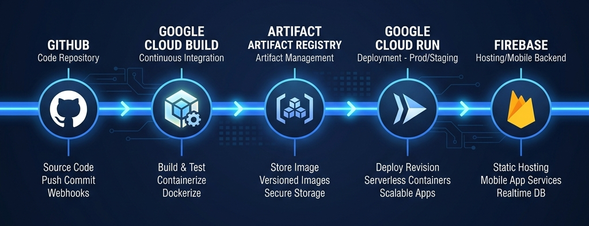
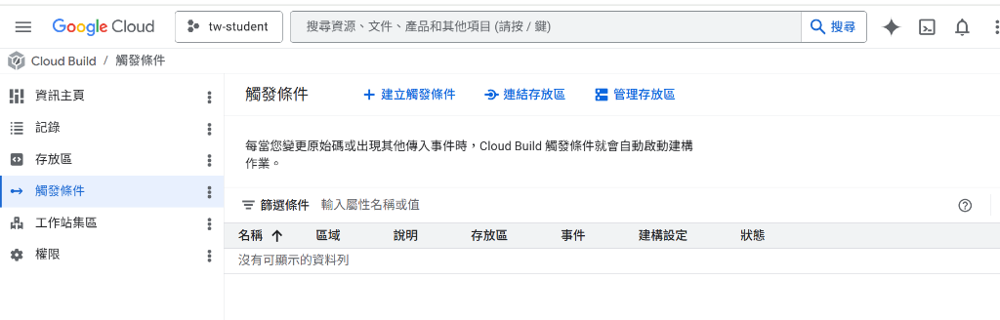

# 臺灣教育 Atlas | 部署說明 (GitOps Workflow)



本文件說明「臺灣教育 Atlas」專案的自動化部署架構與流程。我們採用完全自動化的 **GitOps** 工作流，確保代碼從提交至發布皆受到嚴密的監控與管理。

---

## 🚀 部署架構概覽 (Modern Architecture)

我們的 CI/CD 流程旨在實現極速載入與高安全性：
*   **Source**: GitHub (2nd Gen Connection)
*   **Build**: Google Cloud Build
*   **Registry**: Google Artifact Registry
*   **Compute**: Google Cloud Run (Asia-East1: Taipei)
*   **Hosting**: Firebase Hosting (Global Edge CDN)

---

## 🛠️ 部署流程 (Step-by-Step)

### STEP 01: GitHub 源碼代控
開發流程始於 GitHub。我們採用 **GCP 第 2 代連線 (2nd Gen)**，透過 OAuth 2.0 建立受信任的專屬連結。


*   **Provider**: GitHub Enterprise
*   **Auth**: OAuth 2.0 Handshake

```bash
# 推送代碼至生產分支
git add .
git commit -m "feat: upgrade pipeline"
git push origin main
```

### STEP 02: GCP 原生自動編譯
GCP 會根據儲存在 **Secret Manager** 的安全憑證，主動「拉取」源碼。建構器會自動讀取 `infra/cloudbuild.yaml` 組態。


*   **Engine**: Cloud Build Core
*   **Runtimes**: Node.js 25 (Alpine)

```yaml
# Cloud Build 自動拉取與編譯
steps:
- name: 'gcr.io/cloud-builders/docker'
  args: ['build', '-t', 'gcr.io/$PROJECT_ID/atlas', '.']
```

### STEP 03: 代碼容器鏡像
編譯後的鏡像將被妥善儲存於 **Artifact Registry**。提供企業級的弱點掃描機制，並保證極低拉取延遲。


*   **Registry**: Google Artifact GCR
*   **Security**: Vulnerability Scanning

```bash
# 映像檔版本管理 (Semantic Versioning)
gcloud artifacts repositories list \
  --project=tw-student \
  --location=asia-east1
```

### STEP 04: 無伺服器部署
建置後自動部署至 **Google Cloud Run**。服務運行於台北 (asia-east1) 數據中心，確保台灣使用者享有毫秒級的載入體驗。


*   **Location**: Asia-East1 (Taipei)
*   **Scaling**: Serverless Auto-scale

```bash
# 部署至台北 (asia-east1) 節點
gcloud run deploy tw-student-portal \
  --image asia-east1-docker.pkg.dev/atlas \
  --region asia-east1
```

### STEP 05: 前端邊緣託管
靜態資源與前端文件將透過 **Firebase Hosting** 進行分流。藉由全球節點快取，實現首屏即現的高效服務。


*   **Traffic**: Multi-CDN Delivery
*   **Cache**: Next-Gen Edge Caching

```bash
# CDN 全球分流與預覽
firebase deploy --only hosting \
  --project tw-student \
  --message "v1.2.0 production-ready"
```

---

## ⚙️ 初始設定 (Initial Setup)

### STEP 06 (INIT): 雲端主機連線
透過第 2 代連線機制將 GitHub 帳務連結至 GCP 專案，確保所有的源碼與憑證皆受到 **IAM 管理策略** 的保護。



*   **Security**: OAuth 2.0 Encrypted
*   **Latency**: Direct Backbone

```bash
# 啟動 GitHub 連線初始化
gcloud builds connections create github "github-host" \
  --region=asia-east1

# 驗證連線狀態
gcloud builds connections list --region=asia-east1
```

### STEP 07 (CONFIG): 全自動化觸發核心
將連線後的 Repository 綁定至特定的 **Artifact Registry**，僅在 `infra/` 變動時觸發重新編譯，節省運算成本。


*   **Triggering**: Event-based (Webhook)
*   **Registry**: Artifact Registry GCR

```bash
# 注入日誌寫入權限 (IAM Hardening)
gcloud projects add-iam-policy-binding tw-student \
  --member="serviceAccount:firebase-adminsdk-fbsvc@tw-student.iam.gserviceaccount.com" \
  --role="roles/logging.logWriter"
```

---

## ✅ 部署作業完成 (Ready to Scale)

臺灣教育 Atlas 已成功建立全自動 GitOps 部署管線。當代碼更新時，系統將自動處理從鏡像編譯至全球分流的所有細節。

*   **Environment**: Production Ready
*   **Reliability**: 99.9% SLI Target
*   **Scale**: Auto-Scaling Active
